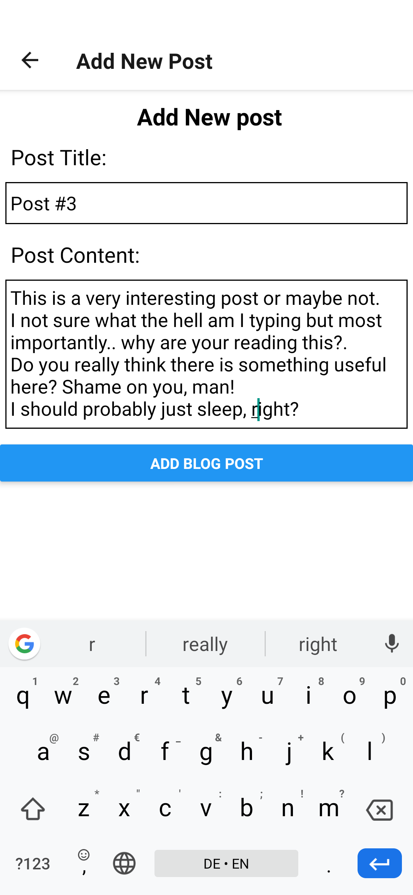
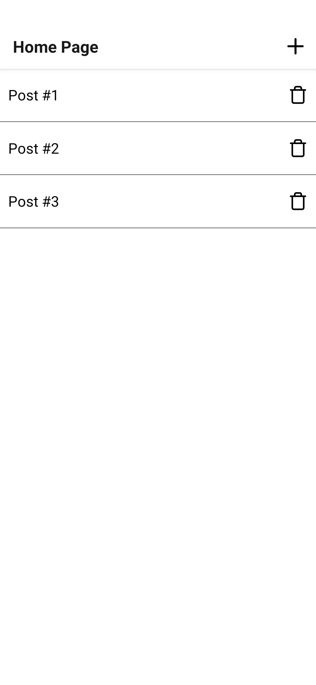
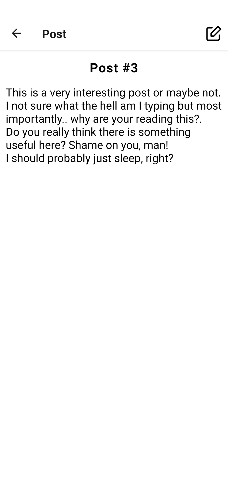
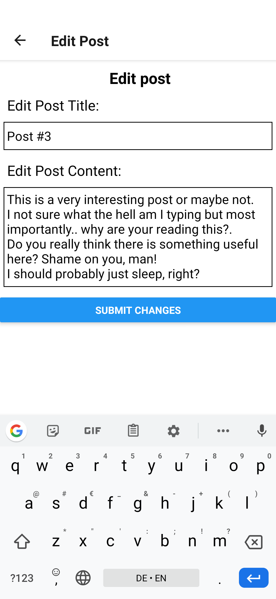

## Blogger

Simple React Native blog management application

## Getting Started

Getting up and running is as easy.

1. Make sure you have [NodeJS](https://nodejs.org/) and [npm](https://www.npmjs.com/) installed.
2. Install your dependencies

   ```
   cd path/to/Blogger

   npm install -g expo-cli

   npm install
   ```

3. Start your app

   ```
   npm start
   ```

4. Run the json server and ngrok with
   ```
   npm run server
   ```
5. Update the URL from ngrok to the "api/jsonServer.js" file

6. Install [Expo](https://play.google.com/store/apps/details?id=host.exp.exponent&hl=en_US) Android Application

7. Scan the QR code and you are good to go.

## Screenshots






## Support

Please feel free to contact me if you have any questions/concerns.
